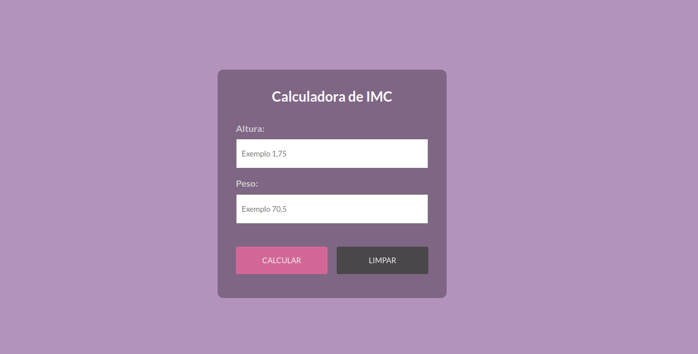
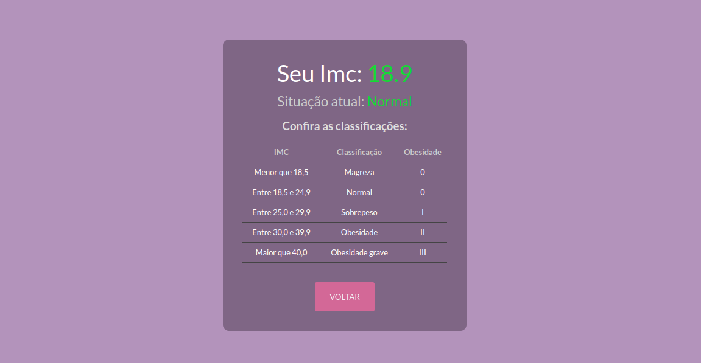

# Calculadora de IMC

A calculadora de IMC foi criada com o objetivo de aprender e praticar os conceitos fundamentais do React.

Esse projeto foi feito através do curso Formação Front-end do <a href="https://www.udemy.com/user/matheus-battisti/" target="_blank">Matheus Battisti</a>
na plataforma <a href="https://www.udemy.com" target="_blank">Udemy</a>.

## O projeto

Este projeto é uma calculadora de Índice de Massa Corporal (IMC) desenvolvida em React, utilizando JavaScript, HTML e CSS. O IMC é uma medida utilizada para avaliar se uma pessoa está dentro de um peso saudável para sua altura. A aplicação permite que o usuário insira sua altura e peso e, com base nesses dados, calcula o IMC, fornecendo imediatamente o resultado e indicando se o usuário está acima do peso, dentro do peso saudável ou abaixo do peso.

### Linguagens usadas:

- 
- 
- 
- 

## Meus aprendizados em React no curso:

**1. Componentização em React:** Aprendi a dividir a interface do usuário em componentes reutilizáveis, como campos de entrada, botão de cálculo e exibição de resultados.

**2. Estados e Props:** O conceito de estados e props em React e como eles são usados para controlar e passar dados entre os componentes.

**3. Manipulação de Formulários:** A experiência na manipulação de dados de formulários em React, capturando entradas do usuário e atualizando os estados correspondentes.

**4. Gestão de Estados:** A atualização dos estados da aplicação de forma reativa, garantindo que a interface do usuário reflita sempre o estado atual dos dados.

**5. Ciclo de Vida dos Componentes:** O ciclo de vida dos componentes em React, compreendendo quando os componentes são montados, atualizados ou desmontados, e como aproveitar esses eventos para realizar ações específicas.

**6. Estilização com CSS em React:** Aplicar estilos CSS aos componentes React, seja utilizando CSS puro, módulos CSS.

**7. Manipulação de Eventos:** A captura e tratamento de eventos do usuário, como cliques de botão, para desencadear ações na aplicação, como o cálculo do IMC.

**8. Feedback ao Usuário:** Os mecanismos para fornecer feedback visual ao usuário, como mensagens indicando o resultado do cálculo e se ele está acima, dentro ou abaixo do peso saudável.

**9. Depuração e Resolução de Problemas:** Os desafios durante o desenvolvimento e adquiri habilidades de depuração para identificar e corrigir erros no código.

**10. Boas Práticas de Desenvolvimento:** Adotei as boas práticas de desenvolvimento, como organização de código, comentários explicativos, nomeação significativa de variáveis e funções.

#### O meu aprendizado é contínuo e esse é apenas <u>o meu primeiro projeto em React</u>.
